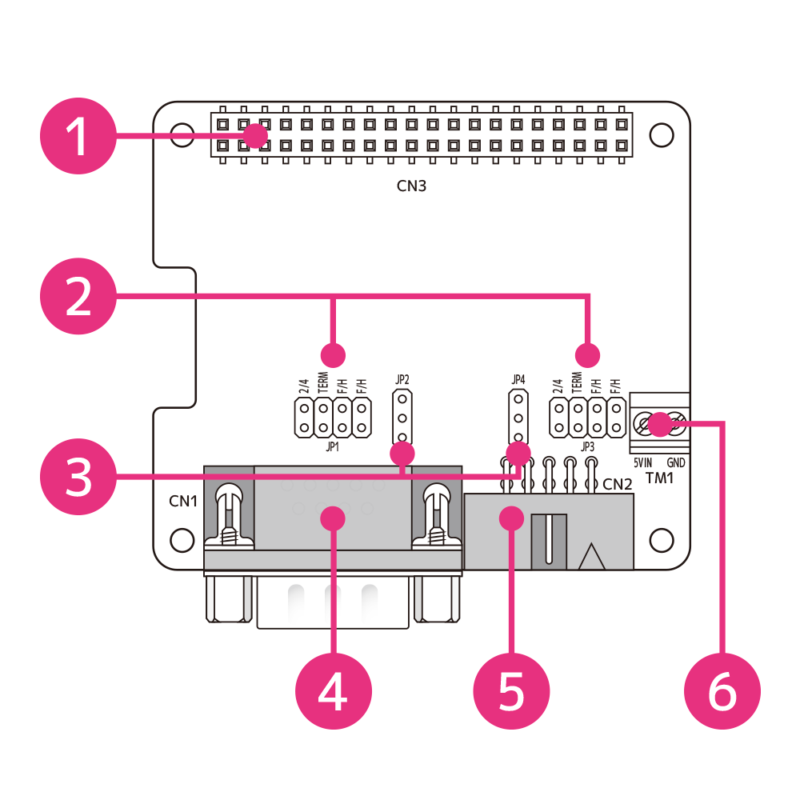
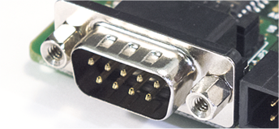

# RPi-GP60 各部名称と説明  
___  
## 1. 基板構成  
製品基板の各部名称は以下のとおりです。  

  

| No | 名称 | 機能 |  
|:-----:|:-----|-----|  
|1|GPIO 40PINコネクタ|Raspberry Pi GPIO|  
|2|JP1/JP3 ジャンパピン|シリアルポート0,1 通信設定|  
|3|JP2/JP4 ジャンパピン|シリアルポート0,1 電源設定|  
|4|CN1 DB-9コネクタ |シリアルポート0 |  
|5|CN2 10ピンボックスヘッダ |シリアルポート1 ||  
|6|TM1 外部5V入力ネジ端子 |シリアルポート9番ピンへの+5V供給専用電源入力 |  

※外部5V入力(ネジ端子)の適合電線はAWG26～AWG16, ストリップ長は5mmです。  
___  
## 2. 各端子・コネクタについて  
### 2-1. GPIO 40PINコネクタ  
GPIO 40 PIN の配列および使用ピンは以下のとおりです。  
  

40PIN GPIOのピン配列と説明  

| PIN# | 信号名 | 説明 | PIN# | 信号名 | 説明 |  
|:---:|:---|:---|:---:|:---|:---|  
|1|3.3V|3.3V電源|2|5V|5V電源|  
|3|I2C SDA1/GPIO 2|I2C SDA1|4|5V|5V電源|  
|5|I2C SCL1/GPIO 3|I2C SCL1|6|GND|GND|  
|7|GPIO 4|(未使用)|8|GPIO 14|(未使用)|  
|9|GND|GND|10|GPIO 15|(未使用)|  
|11|IRQ/GPIO 17|IRQ入力|12|GPIO 18|(未使用)|  
|13|GPIO 27|絶縁電源制御|14|GND|GND|  
|15|GPIO 22|(未使用)|16|GPIO 23|(未使用)|  
|17|3.3V|3.3V電源|18|GPIO 24|(未使用)|  
|19|SPI0 MOSI/GPIO 10|(未使用)|20|GND|GND|  
|21|SPI0 MISO/GPIO 9|(未使用)|22|GPIO 25|(未使用)|  
|23|SPI0 SCLK/GPIO 11|(未使用)|24|SPI CE0/GPIO 8|(未使用)|  
|25|GND|GND|26|SPI CE1/GPIO 7|(未使用)|  
|27|I2C SDA0/GPIO 0| HAT_ID読み込み用I2C |28|I2C SCL0/GPIO 1|HAT_ID読み込み用I2C|  
|29|GPIO 5|(未使用)|30|GND|GND|  
|31|GPIO 6|(未使用)|32|GPIO 12|(未使用)|  
|33|GPIO 13|(未使用)|34|GND|GND|  
|35|GPIO 19|(未使用)|36|GPIO 16|(未使用)|  
|37|GPIO 26|(未使用)|38|GPIO 20|(未使用)|  
|39|GND|GND|40|GPIO 21|(未使用)|  

### 2-2. シリアルポート0 [DB-9コネクタ]  
シリアルポート0[CN1]はDsub-9ピンコネクタを使用しています。  
  
ボード上のジャンパで機能を設定します。  
RS-232C, RS-485/RS-422A(半二重/全二重), 終端抵抗の設定が可能です。  
RS-232Cモードの場合、D-Sub9ピンの端子配列はEIA-574規格に準拠します。  
RS-485/RS-422Aモードの場合、独自の端子配列となります。  
詳細については[RPi-GP60の設定と装着](../setup/README.md)を参照してください。  

### 2-3. シリアルポート1 [10ピンボックスヘッダコネクタ]  
シリアルポート1[CN2]は10ピンボックスヘッダコネクタを使用しています。  
  
10ピンボックスヘッダ接続用D-Sub 9ピン変換ケーブル(約10cm)が付属しています。  
  
ボード上のジャンパで機能を設定します。  
RS-232C, RS-485/RS-422A(半二重/全二重), 終端抵抗の設定が可能です。  
RS-232Cモードの場合、D-Sub9ピンの端子配列はEIA-574規格に準拠します。  
RS-485/RS-422Aモードの場合、独自の端子配列となります。  
詳細については[RPi-GP60の設定と装着](../setup/README.md)を参照してください。  

### 2-4. 外部5V入力ネジ端子  
シリアルポート9番ピン[RI]を基板上のジャンパ設定で[5V]に切り替えた場合にのみ、この外部5V電源を使用します。  
5V入力端子配列は以下のとおりです。  

|TM#-Pin#|信号名|機能|  
|:---:|:---|:---|  
|TM1-1|5VIN|外部5V入力（5V±10%）|  
|TM1-2|GND|外部 GND|  

※外部5V入力(ネジ端子)の適合電線はAWG26～AWG16, ストリップ長は5mmです。  

___  

