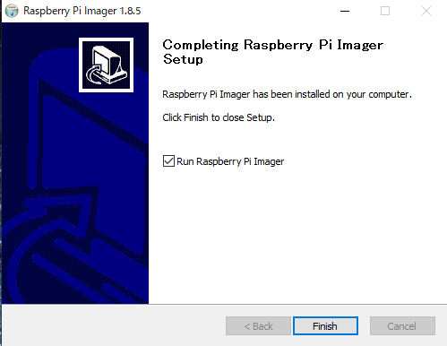

# Raspberry Pi OSの設定

Rapberry Pi用のOSである Raspberry Pi OS(旧Rasbian※)の設定について説明します。  
Raspberry Pi本体は'Raspberry Pi4 ModelB'、
Raspberry Pi Imagerは、'Raspberry Pi Imager 1.8.5'、
OSは'Raspberry Pi OS Version 2024-03-07'で説明します。
※2020年5月に名称が「Rasbian」から「Raspberry Pi OS」に変更されました。

## Raspberry Pi OSのインストール  

###	1. Class10のmicroSD(8～32G)を用意します。

*64GB以上のSDカードの場合、exFATでフォーマットされます。
Raspberry Pi OSはexFATに対応していませんので、別のツールを使ってFAT16またはFAT32でフォーマットする必要があります。*

### 2. Raspberry財団公式ホームページ( https://raspberrypi.org/software/ )でRaspberry Pi Imager をダウンロードしてインストールします。

2-1. ダウンロードしたファイルをダブルクリックします。

  

2-2. [Install] をクリックします。

  

2-3. 終了画面で[Finish]をクリックします。

  

### 3. Raspberry Pi Imager を使って Raspberry Pi OS のSDカードを作成します。

3-1. Raspberry Pi Imagerが起動すると以下の画面が表示されます。

    

3-2. [デバイスを選択]をクリックしてRaspberry Pi デバイスを選択します。

   

3-3. [OSを選択]をクリックして[Raspberry Pi OS (64-bit)]を選択します。

   
   

3-4. [ストレージを選択]をクリックして、書き込み先のデバイス（SD Card）を選択します。
 
   
   

3-5. [次へ] をクリックします。

   

3-6. OSのカスタマイズ設定を変更が不要であれば、[いいえ] をクリックします。

   

3-7. 確認ダイアログ画面で [はい]を選択して、SD Cardへの書き込みを開始します。

   

3-8. 途中、書き込みの進捗状況が表示されます。

   
   
   

3-7. 書き込みが終わると、以下の完了画面が表示されます。
　　[続ける] をクリックして、microSDカードを取り外します。

   

### 4. OSの起動と日本語モードの設定

4-1. microSDカードをRaspberry Pi基板に接続し起動します。  
　　最初に国情報、ユーザー名、WiFi設定等の設定画面が表示されます。
　　必要に応じて、タイムゾーンの設定、キーボードの設定、無線LANの国設定 等の設定を行います。
　　これらを設定後、再駆動します。

   

## I2Cの有効設定  

### [Raspberry Pi の設定]の[インターフェース]で"I2C"を有効にします。

     
     

設定を反映させるため、OSを再起動すれば、Raspberry Pi OS のインストールと設定は完了です。