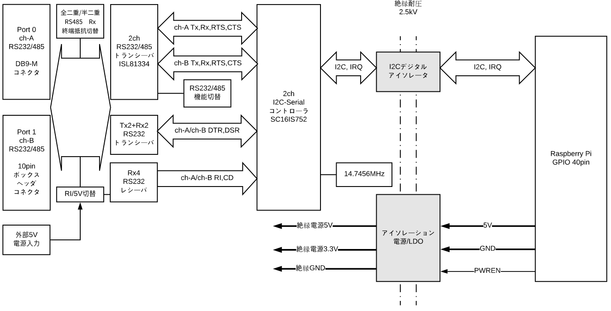
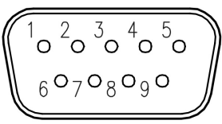
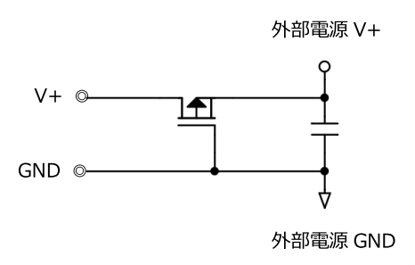

# RPi-GP60の機能と説明  
各インターフェースについて説明します。ブロック図は以下の通りです。  

  

___  
## 1. インターフェース  
### 1-1. Rapsberry Pi GPIO 40pin  
RPi-GP60を制御するために、GPIO 40pinの下記の信号を使用します。  
  
<u>制御信号</u>  
  
| PIN# | 名称 | 機能説明 |  
|:---:|:---|:---|  
|3|I2C SDA1|シリアルコントローラ用I2C|  
|5|I2C SCL1|シリアルコントローラ用I2C|  
|11|GPIO17|シリアルコントローラ割り込み要求 1:なし / 0:あり|  
|13|GPIO27|絶縁電源制御出力  1:ON / 0:OFF|  
|27|GPIO0/ID_SD|HAT_ID読み込み用I2C|  
|28|GPIO1/ID_SC|HAT_ID読み込み用I2C|  

<u>電源端子</u>  
  
|PIN#|説明|  
|:--:|:--:|  
|1pin 17pin|3.3V|  
|2pin 4pin|5V|  
|6pin 9pin 14pin 20pin 25pin 30pin 34pin 39pin|GND|  
  
### 1-2. I2Cアドレス  
シリアルコントローラを制御するためのI2Cアドレスは以下のとおりです。  

<u>２ポートシリアルコントローラ(SC16IS752)</u>  
基板上の半田ジャンパでシリアルコントローラ(SC16IS752)のI2Cアドレス設定変更が可能です。  
出荷時のI2Cアドレス(7bit)は`0x4D`に設定されています。  
設定変更方法については[RPi-GP60の設定と装着](../setup/README.md)を参照してください。  

### 1-3. ポート0シリアルコネクタ  
ポート0シリアルコネクタの端子配列  
  
CN1 DB9-オス型コネクタ  

基板上のジャンパ設定により、以下の３種類があります。  

|ピン番号|RS232 信号名 *1|I/O||説明|
|:--:|:--|:--:|:--|:--|
|1|DCD|I|Date Carrier Detect|キャリア検出入力|
|2|RXD|I|Receive Data|受信データ入力|
|3|TXD|O|Transmit Data|送信データ出力|
|4|DTR|O|Data Terminal Ready|データ端末レディ出力|
|5|GND|-|Ground|信号用接地|
|6|DSR|I|Data Set Ready|データセットレディ入力|
|7|RTS|O|Request To Send|送信要求出力|
|8|CTS|I|Clear To Send|送信許可入力|
|9|RI/5V *4|I/O|Ring Indicator / 5VOUT|被呼表示入力 / 外部5V出力|  

*1: ジャンパピンJP1-1設定がオープン時[RS232]  
*4: ジャンパピンJP2 1-2間ショート時[RI] / 2-3間ショート時[5V](外部電源出力)  

|ピン番号|RS485/422 全二重 信号名 *2|I/O|説明|
|:--:|:--|:--:|:--|
|1|-|-|(接続禁止)|
|2|RXD-|I|受信データ差動－側入力|
|3|TXD-|O|送信データ差動－側出力|
|4|-|-|(接続禁止)|
|5|GND|-|信号用接地|
|6|RXD+|I|受信データ差動＋側入力|
|7|TXD+|O|送信データ差動＋側出力|
|8|-|-|(接続禁止)|
|9|(5V)|(O)|(外部5V出力)|  

*2: ジャンパピンJP1-1設定がショート時[RS485/422]で、JP1-3,4設定がオープン時[全二重]  

|ピン番号|RS485 半二重 信号名 *3|I/O|説明|
|:--:|:--|:--:|:--|
|1|-|-|(接続禁止)|
|2|DATA-|I/O|データ差動－側入出力|
|3|-|-|(接続禁止)|
|4|-|-|(接続禁止)|
|5|GND|-|信号用接地|
|6|DATA+|I/O|データ差動＋側入出力|
|7|-|-|(接続禁止)|
|8|-|-|(接続禁止)|
|9|(5V)|(O)|(外部5V出力)|  

*3: ジャンパピンJP1-1設定がショート時[RS485/422]で、JP1-3,4設定がショート時[半二重]  

### 1-4. ポート1シリアルコネクタ  
ポート1シリアルコネクタの端子配列  
  
CN2 10ピンボックスヘッダコネクタ  
※付属の「10ピンボックスヘッダ接続用D-Sub 9ピン変換ケーブル(約10cm)」を接続すると、ポート0と同じ端子配列となります。

基板上のジャンパ設定により、以下の３種類があります。  

|ピン番号|RS232 信号名 *5|I/O||説明|
|:--:|:--|:--:|:--|:--|
|1|DCD|I|Date Carrier Detect|キャリア検出入力|
|2|RXD|I|Receive Data|受信データ入力|
|3|TXD|O|Transmit Data|送信データ出力|
|4|DTR|O|Data Terminal Ready|データ端末レディ出力|
|5|GND|-|Ground|信号用接地|
|6|DSR|I|Data Set Ready|データセットレディ入力|
|7|RTS|O|Request To Send|送信要求出力|
|8|CTS|I|Clear To Send|送信許可入力|
|9|RI/5V *8|I/O|Ring Indicator / 5VOUT|被呼表示入力 / 外部5V出力|
|10|-|-||未接続|  

*5: ジャンパピンJP3-1設定がオープン時[RS232]  
*8: ジャンパピンJP4 1-2間ショート時[RI] / 2-3間ショート時[5V](外部電源出力)  

|ピン番号|RS485/422 全二重 信号名 *6|I/O|説明|
|:--:|:--|:--:|:--|
|1|-|-|(接続禁止)|
|2|RXD-|I|受信データ差動－側入力|
|3|TXD-|O|送信データ差動－側出力|
|4|-|-|(接続禁止)|
|5|GND|-|信号用接地|
|6|RXD+|I|受信データ差動＋側入力|
|7|TXD+|O|送信データ差動＋側出力|
|8|-|-|(接続禁止)|
|9|(5V)|(O)|(外部5V出力)|
|10|-|-|未接続|  

*6: ジャンパピンJP3-1設定がショート時[RS485/422]で、JP3-3,4設定がオープン時[全二重]  

|ピン番号|RS485 半二重 信号名 *7|I/O|説明|
|:--:|:--|:--:|:--|
|1|-|-|(接続禁止)|
|2|DATA-|I/O|データ差動－側入出力|
|3|-|-|(接続禁止)|
|4|-|-|(接続禁止)|
|5|GND|-|信号用接地|
|6|DATA+|I/O|データ差動＋側入出力|
|7|-|-|(接続禁止)|
|8|-|-|(接続禁止)|
|9|(5V)|(O)|(外部5V出力)|
|10|-|-|未接続|  

*7: ジャンパピンJP3-1設定がショート時[RS485/422]で、JP3-3,4設定がショート時[半二重]  

### 1-5. 外部5V入力  
外部5V入力は、シリアルコネクタの9番端子[RI]が[5V]に設定されている場合のみ使用します。  
入力電圧は５V（±10%）です。  
下図のような回路構成で、逆極性接続保護用のP-ch MOSFETが付いています。  
  

## 2. シリアルコントローラ  
シリアルコントローラとして、NXP社SC16IS752を使用しています。  
I2Cアドレス(7bit)の初期値は`0x4D`で、基板上のハンダジャンパで設定変更が可能です。  
設定方法の詳細については[RPi-GP60の設定と装着](../setup/README.md)を参照してください。  

### 2-1. SC16IS752レジスタマップ  
SC16IS752のレジスタマップは以下のとおりです。各レジスタの機能詳細については、NXP社の[SC16IS752データシート](../datasheet)を参照してください。  
ただし、SC16IS752のシリアルドライバがTTYとしてカーネルから制御されている場合は、ユーザープログラムはレジスタに対してI2Cコマンドでのアクセスができません。  
pythonの場合は[pyserialモジュール](https://pythonhosted.org/pyserial/index.html)を使用することで、ドライバ経由での制御が使用可能です。  
pyserialモジュールを使用した[シリアル通信サンプルプログラム](../python/README.md)も参照願います。

|Adrs|name|Read mode|Write mode|
|:--:|:--|:--|:--|
|0x00|RHR/THR|Receive Holding Register (RHR)|Transmit Holding Register (THR)|
|0x01|IER|Interrupt Enable Register (IER)|Interrupt Enable Register|
|0x02|IIR/FCR|Interrupt Identification Register (IIR)|FIFO Control Register (FCR)|
|0x03|LCR|Line Control Register (LCR)|Line Control Register|
|0x04|MCR|Modem Control Register (MCR)|Modem Control Register|
|0x05|LSR|Line Status Register (LSR)|n/a|
|0x06|MSR|Modem Status Register (MSR)|n/a|
|0x07|SPR|Scratchpad Register (SPR)|Scratchpad Register|
|0x06|TCR|Transmission Control Register (TCR)|Transmission Control Register|
|0x07|TLR|Trigger Level Register (TLR)|Trigger Level Register|
|0x08|TXLVL|Transmit FIFO Level register|n/a|
|0x09|RXLVL|Receive FIFO Level register|n/a|
|0x0A|IODir|I/O pin Direction register|I/O pin Direction register|
|0x0B|IOState|I/O pins State register|n/a|
|0x0C|IOIntEna|I/O Interrupt Enable register|Interrupt Enable register |
|0x0E|IOControl|I/O pins Control register|I/O pins Control register|
|0x0F|EFCR|Extra Features Control Register|Extra Features Control Register|
|0x00|DLL|Divisor Latch LSB (DLL)|Divisor Latch LSB|
|0x01|DLH|Divisor Latch MSB (DLH)|Divisor Latch MSB|
|0x02|EFR|Enhanced Features Register (EFR)|Enhanced Features Register|
|0x04|XON1|Xon1 word|Xon1 word|
|0x05|XON2|Xon2 word|Xon2 word|
|0x06|XOFF1|Xoff1 word|Xoff1 word|
|0x07|XOFF2|Xoff2 word|Xoff2 word|

### 2-2. ボーレート設定  
SC16IS752のクロックとして、14.7456MHzの水晶振動子を使用しています。  
代表的なボーレートジェネレータ(DLL,DLH)の設定値は以下のとおりです。

|ボーレート[bps]|設定値|備考|
|--:|--:|:--|
|110|8378||
|300|3072||
|1200|768||
|2400|384||
|4800|192||
|9600|96||
|14400|64||
|19200|48||
|38400|24||
|57600|16||
|115200|8|I2C速度(標準100kHz)を超えるのでフロー制御使用推奨|
|230400|4||
|460800|2|RS232設定時の上限(トランシーバー性能の上限)|
|921600|1|RS485/422設定時の上限(コントローラの上限)||

___  
  
