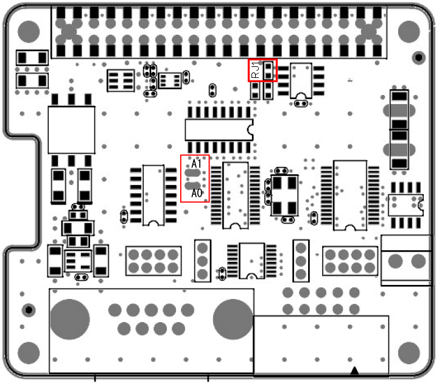

# RPi-GP60の設定と装着  
各種設定と本製品をRaspberry Pi GPIO 40PINに接続する方法を説明します。  

___  
## 1. 各種ハードウェア設定  
  

### 1-0. ID EEPROMの無効化  
2021年4月以降のRPi-GP60は、ID EEPROMが無効化された状態で出荷されます。  
それ以前に出荷されたRPi-GP60では、Raspberry PI 4Bとの組み合わせたときにttySC*ポートが認識されない現象が確認されています。  
ジャンパ抵抗[RJ1]を取り外してID EEPROMを無効化することで改善します。  

### 1-1. I2Cアドレスの設定  
シリアルコントローラSC16IS752のI2Cアドレスを、半田ジャンパ(A0, A1)のオープン/ショートによって設定変更できます。  
※初期設定は`0x4D`(A0～A1オープン)です。  

|A1|A0|I2Cアドレス||
|:--:|:--:|:--:|:--:|
|オープン|オープン|0x4D|※初期設定|
|オープン|ショート|0x4C||
|ショート|オープン|0x49||
|ショート|ショート|0x48||

### 1-2. シリアル通信機能の設定  
基板上のジャンパ設定ピンJP1でPort0(CN1),JP3でPort1(CN2)の通信機能を設定します。出荷時設定はすべてオープンです。  
  

|JP1/JP3<br>ピン番号|オープン(OFF)|ショート(ON)|説明|  
|:--:|:--|:--|:--|  
|1|RS232|RS485/422|RS232モードかRS485/422モードかの設定をします。<br>出荷時設定はオープンでRS232モードです。|  
|2|終端抵抗無効|終端抵抗有効|RS485/422モードで、差動レシーバに120Ω終端抵抗の無効/有効を設定します。<br>RS232モードの場合は必ずオープンにしてください。|  
|3|全二重|半二重|RS485の半二重モードを設定します。<br>RS232やRS422(全二重)モードではオープンにしてください。|  
|4|全二重|半二重|RS485の半二重モードを設定します。<br>RS232やRS422(全二重)モードではオープンにしてください。|  

### 1-3. 外部電源の設定  
ジャンパ設定ピンJP2でCN1,JP4でCN2の9番ピンの機能を、RIとするか外部電源出力とするかの設定をします。出荷時はRI設定です。  
  

|JP2/JP4|機能|説明|  
|:--:|:--|:--|  
|1-2側ショート|RI|CN1, CN2の9番ピンをRIとして設定します。(出荷時設定)|  
|2-3側ショート|5V|CN1, CN2の9番ピンを外部電源5V出力として設定します。|  

### 1-4. RS232ドライバ/レシーバ  
RS232設定時のドライバ/レシーバ部の回路構成です。  
  

### 1-5. RS485/422ドライバ/レシーバ  
RS485/422設定時のドライバ/レシーバ部の回路構成です。  
  

### 1-6. RS485半二重接続例  
デージーチェーン接続された複数のドライバとレシーバで、双方向でのデータ伝送が可能です。（マルチポイント方式）  
最大32台のデバイスが接続できます。  
配線長が一番長くなる両端の終端抵抗を有効にし、それ以外の終端抵抗は無効にしてください。  
また、電線にツイストペアケーブルを使用することで、電磁誘導などによるコモンモードノイズを差動レシーバによって効率的に除去できます。  
  

### 1-7. RS422全二重接続例  
一つのマスタに対して複数のスレーブを接続できます。ドライバ１台に最大10台のレシーバが接続できます。（マルチドロップ方式）  
配線長が一番長くなるレシーバの終端抵抗を有効にして、それ以外のレシーバの終端抵抗は無効にしてください。  
また、電線にツイストペアケーブルを使用することで、電磁誘導などによるコモンモードノイズを差動レシーバによって効率的に除去できます。  
  

### 1-8. 各規格の比較  
規格上は以下のように定められていますが、実際の使用環境では最大値を下回る場合があります。  

|項目|RS-232C|RS-485|RS-422A|  
|:--|:--|:--|:--|  
|準拠規格|TIA/EIA-232-F|TIA/EIA-485-A|TIA/EIA-422-B|  
|端子配列規格|EIA-574|独自|独自|  
|動作モード|非平衡型 (シングルエンド)|平衡型 (差動)|平衡型 (差動)|  
|最大接続可能台数|1ドライバ、1レシーバ|32ドライバ、32レシーバ<br>半二重でのマルチポイント方式に対応|1マスタドライバに10スレーブレシーバ<br>全二重でのマルチドロップ方式|  
|最大ケーブル長(規格値)|15m|1200m<br>ツイストペアケーブルを推奨|1200m<br>ツイストペアケーブルを推奨|  
|最大伝送速度(規格値)|20Kbit/s|10m - 35Mbit/s<br>1200m – 100Kbit/s|1.2m – 10Mbit/s<br>1200m – 100Kbit/s|  
|最大伝送速度(実力値)|460Kbps|920Kbps|920Kbps|  
|特徴|短距離の1対1通信<br>全二重|長距離のN対N通信<br>半二重/全二重|長距離の１マスタ対Nスレーブ通信<br>全二重|  
___  
## 2. 本体の組み立て  
製品付属の40PIN ピンヘッダーを本製品の底面より垂直に装着します。  
※40PINのピンヘッダーの先端は尖っていますので、怪我には十分ご注意ください。  

  

  


## 3. Raspberry Piボードとの接続  
Raspberry Pi 本体のGPIO ピンヘッダと本製品を接続します。  
スペーサー（付属）を本製品本体のネジ穴にあわせ、スペーサーを付
属のネジ（4 本）で固定し、そのままRaspberryPi のGPIO ピンへ垂
直に差し込みます。  
スペーサーがRaspberryPi 基板に合わされば接続は完了です。  
あとはRaspberryPi の背面より付属のネジ（4 本）を使用し、スペーサーを固定します。    
※反対側にも同じようにスペーサーとネジを使用し本体を固定してください。  

  


## 4. シリアルドライバ設定  
SC16IS752のI2CドライバはRaspberry-piに標準で用意されています。
以下の手順で登録することで、2つのシリアルポートがttyとして認識されます。  
### SC16IS752のI2Cドライバ登録と確認手順
1. config.txtをnanoで編集する  
    ```
    $ sudo nano /boot/config.txt
    ```

1. 次の2行を最終行へ追加する  
    ```
    gpio=27=op,dh
    dtoverlay=sc16is752-i2c,int_pin=17,addr=0x4d,xtal=14745600
    ```
    「1-1. I2Cアドレスの設定」でアドレスを変更している場合は、[addr=0x4d]を適宜書き換えてください。  
    2020年8月以降のRaspiOSでは、オーバーレイの前にGPIO27をHighにしてRPi-GP60の絶縁電源をONにする必要があります。

1. CTRL+Oで書き込み、CTRL+Xで終了する  

1. システムを再起動する

1. 再起動後、デバイスツリーに以下のttyポート[/ttySC0],[/ttySC1]が追加されていることを確認する
    ```
    $ ls /dev/ttySC*
    /dev/ttySC0  /dev/ttySC1
    ```

